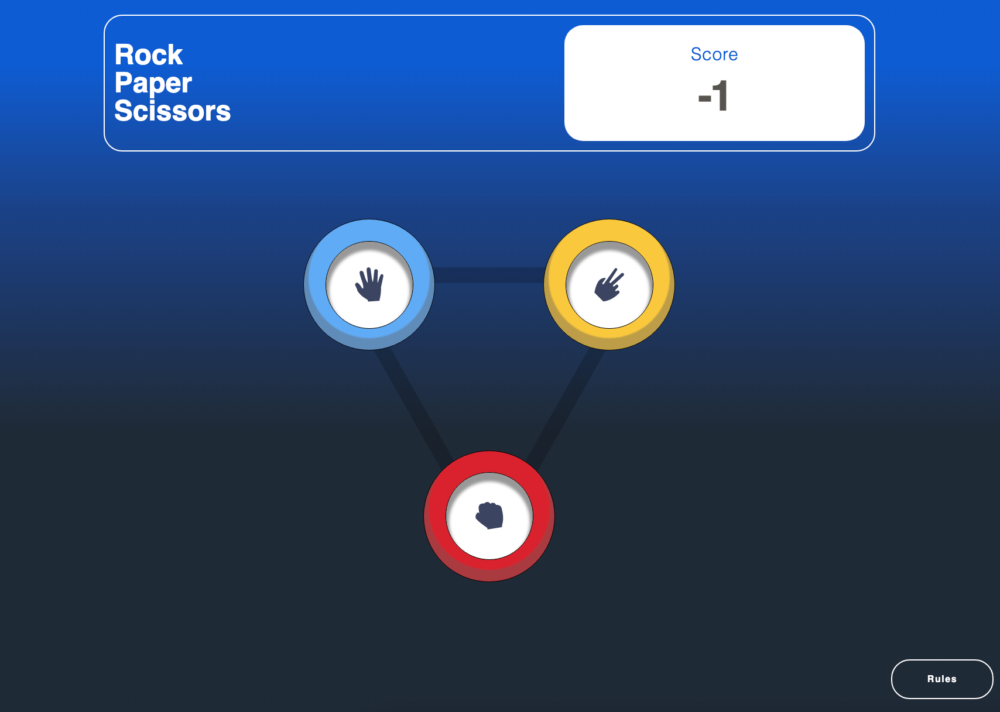

# Frontend Mentor - Rock, Paper, Scissors solution

This is a solution to the [Rock, Paper, Scissors challenge on Frontend Mentor](https://www.frontendmentor.io/challenges/rock-paper-scissors-game-pTgwgvgH). 

## Table of contents

- [Overview](#overview)
  - [The challenge](#the-challenge)
  - [Screenshot](#screenshot)
  - [Links](#links)
- [My process](#my-process)
  - [Built with](#built-with)
  - [What I learned](#what-i-learned)
- [Author](#author)

## Overview

A simple Rock, Paper, Scissors web browser program that allows users to play RPS against a computer. The program also tracks the total tally from the outcome of each round. It is responsive and should work well on most phones, tablets, laptops, and desktops. 

### The challenge

Users should be able to:

- View the optimal layout for the game depending on their device's screen size
- Play Rock, Paper, Scissors against the computer
- Maintain the state of the score after refreshing the browser

### Screenshot



### Links

- Solution URL: [Github](https://github.com/VulnusR/FrontendMentor-RPS-Challenge)
- Live Site URL: [Live Application](https://vulnusr.github.io/FrontendMentor-RPS-Challenge/)

## My process

1) Development of general HTML structure, & CSS/TailwindCSS components
2) Development of JS with a focus on generating/removing html from the page conditionally from user interactions.
3) Development of overall responsiveness between viewports.
4) Development of Rules functionality, additonal JS developed to read and select the proper html sub-componets that render onto the page based from #2, with the JS needed to replace the corrosponding JS and be able to replace it easily and accurately. 
5) Cleaning up of code, final details, & final testing.

### Built with

- Semantic HTML5 markup
- CSS custom properties
- Flexbox
- CSS Grid
- Mobile-first workflow
- [tailwindCSS](https://tailwindcss.com/) - CSS Framework

### What I learned

Use this section to recap over some of your major learnings while working through this project. Writing these out and providing code samples of areas you want to highlight is a great way to reinforce your own knowledge.

To see how you can add code snippets, see below:

I was able to practice tailwindCSS, a popular CSS framework that I like to use but am not the most experienced with. TailwindCSS made the responsiveness requirement aspect of this project fairly straightforward and allowed me to design a consistent and pseuso-modular web application in a fairly streamlined way. 

For Example in my htl you can see how different viewports md/lg/xl have different effects applied in order to make the application more responsive; it is fairly concise and easy to follow:

```html
<button id="btn-paper" type="button" class="btn-game absolute -bottom-5 -left-7 main-game-btn bg-blue-400  hover:bg-sky-400 hover:sm-white-shadow-effect md:md-main-game-btn md:-bottom-8 md:-left-10 md:hover:white-shadow-effect lg:lg-main-game-btn lg:-bottom-11 lg-left-13 xl:xl-main-game-btn">
              <div class="game-btn-inner bg-white md:md-game-btn-inner lg:lg-game-btn-inner xl:xl-game-btn-inner">
                
              </div>
```

And in the CSS you can see how these different effects are built to be applied to different viewports:
```css
.sm-white-shadow-effect {
        box-shadow:
            rgba(95, 93, 93, 0.639) 0px -5px 0px 5px inset,
            rgba(255, 255, 255, 0.9) 0px 0px 1px 2px,
            rgba(255, 255, 255, 0.75) 0px 0px 4px 15px,
            rgba(255, 255, 255, 0.6) 0px 0px 8px 25px,
            rgba(255, 255, 255, 0.45) 0px 0px 16px 40px,
            rgba(255, 255, 255, 0.3) 0px 0px 32px 75px
    }

    .white-shadow-effect {
        box-shadow:
            rgba(95, 93, 93, 0.639) 0px -10px 0px 5px inset,
            rgba(255, 255, 255, 0.9) 0px 0px 1px 2px,
            rgba(255, 255, 255, 0.75) 0px 0px 7px 5px,
            rgba(255, 255, 255, 0.6) 0px 0px 20px 25px,
            rgba(255, 255, 255, 0.45) 0px 0px 40px 75px,
            rgba(255, 255, 255, 0.3) 0px 0px 100px 100px
    }
```
## Author

- Github - [VulnusR](https://github.com/VulnusR)
- Frontend Mentor - [@VulnusR](https://www.frontendmentor.io/profile/VulnusR)
